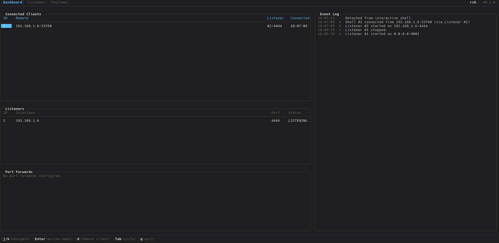

# rsh

[](#requirements)
[](#features)

`rsh` is a terminal UI for managing TCP listeners, monitoring reverse shell sessions, attaching to active connections, and generating operator-friendly payloads for controlled lab environments.

> [!WARNING]
> For authorized lab use only. This project is intended for red team simulation, adversary emulation, and defensive validation in controlled environments. Do not deploy it against third-party systems.

Built with [Bubble Tea](https://github.com/charmbracelet/bubbletea), `rsh` keeps the listener, session, and payload workflow in one interface.



## Features

### Listener Control

- Create and manage multiple TCP listeners from the TUI
- Bind listeners to a specific network interface or `0.0.0.0`
- Stop listeners directly from the interface
- Start with a default listener on `0.0.0.0:9001`

### Session Monitoring

- Track incoming shell connections in real time
- See which listener received each session
- View active shells from a single dashboard
- Keep an in-app activity log for listener and session events

### Interactive Shell Access

- Attach to an active shell from the dashboard
- Attempt automatic PTY upgrade for a better interactive session
- Detach cleanly and return to the TUI with `F12`

### File Delivery

- Send a local file through an existing shell connection
- Choose the destination path from the dashboard flow
- Keep delivery inside the same operator interface

### Post-Exploitation Tooling

- Stage post-exploitation tools directly from the client action menu
- Multi-select LinPEAS and Chisel with a single workflow
- Detect the remote Linux architecture over the existing shell
- Download release assets to the operator cache, then upload them to the client
- Keep the client fully offline during tool staging

### Payload Generation

- Generate ready-to-use reverse shell one-liners
- Includes Bash TCP and Netcat named-pipe payload options
- Copy payloads directly to the clipboard from the Payload tab
- Build payloads from the currently selected listener context

> [!NOTE]
> Payload generation requires a listener bound to a specific interface IP. If the listener is bound to `0.0.0.0`, `rsh` cannot determine the callback host to embed.

### Operator Experience

- Keyboard-driven navigation across all tabs
- Separate views for Dashboard, Listener, and Payload workflows
- Fast shell actions from the connected-client table
- Compact terminal-first workflow for lab operations
- Dashboard visibility for staged Chisel port-forward tooling

## Capabilities

`rsh` currently provides:

- Multi-listener management
- Live session tracking
- Interactive shell attachment
- Session disconnect handling
- Basic file upload through active sessions
- Post-exploitation tool staging for Linux lab shells
- Clipboard-friendly payload generation
- Event visibility inside the TUI

## Requirements

- Go `1.25`
- A Unix-like environment with a real terminal
- One clipboard helper for payload copy support:
  - `xclip`
  - `xsel`
  - `wl-copy`

For the best interactive shell experience on the remote host, one of these should be available:

- `python3`
- `python`
- `script`

## Getting Started

### Run from source

```bash
go run .
```

### Build a binary

```bash
go build -o rsh .
./rsh
```

## Usage

When the UI opens:

1. `Dashboard` shows listeners, connected shells, and recent activity.
2. `Listener` is used to create and stop listeners.
3. `Payload` is used to generate callback payloads from active listeners.

Top-level navigation:

- `1`, `2`, `3` switch tabs
- `Tab` and `Shift+Tab` cycle tabs
- `q` or `Ctrl+C` quits

Listener workflow:

- `i` or `a` enters insert mode
- `h` and `l` cycle interfaces
- `Tab` moves between interface and port
- `Enter` starts the listener
- `d` or `x` stops the selected listener

Dashboard workflow:

- `Enter` opens shell actions
- Choose interactive shell, file upload, or post-exploitation tooling
- In the post-ex tooling modal, use `Space` to multi-select and `Enter` to stage uploads
- `d` removes the selected shell

Payload workflow:

- `j` and `k` select a payload
- `h` and `l` switch target listeners
- `Enter` or `y` copies the generated command
